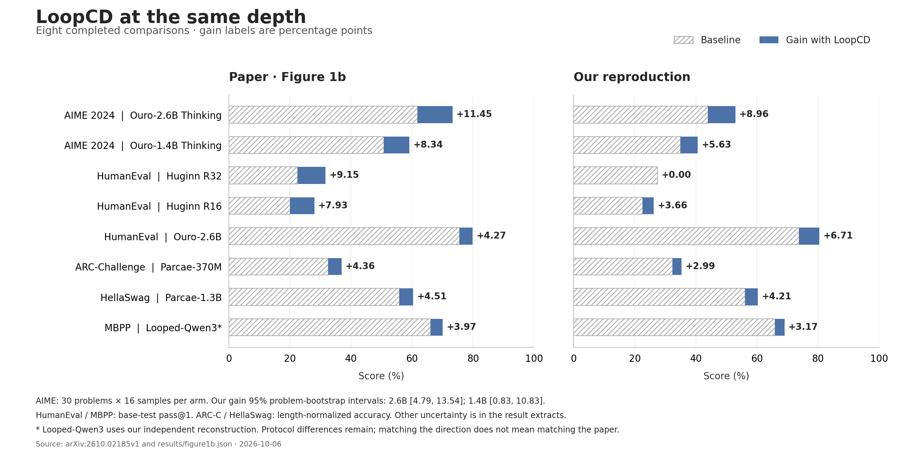

# Reproduction of LoopCD

Code and results for the eight **Figure 1b** comparisons in **[Decoding Looped Transformers Better for (Almost) Free](https://arxiv.org/abs/2610.02185)**.

We ran each benchmark with and without LoopCD at the same depth. Seven comparisons improve; Huginn R32 is unchanged. All eight runs are complete. The table below shows our scores alongside the paper's, including the baseline differences.

## Results



[Vector figure (SVG)](figures/figure1b-comparison.svg) · [PDF](figures/figure1b-comparison.pdf)

Scores are percentages; Δ is an absolute percentage-point change. Code tasks use the original benchmark tests, not the extended `Plus` tests. ARC-C and HellaSwag use length-normalized accuracy (`acc_norm`).

<!-- RESULTS:START -->
| Benchmark | Model | Paper baseline → LoopCD | Ours baseline → LoopCD | Δ paper / ours |
|---|---|---:|---:|---:|
| AIME 2024 | Ouro-2.6B Thinking | 61.88 → 73.33 | 43.96 → 52.92 | +11.45 / +8.96 |
| AIME 2024 | Ouro-1.4B Thinking | 50.83 → 59.17 | 35.00 → 40.63 | +8.34 / +5.63 |
| HumanEval | Huginn R32 | 22.56 → 31.71 | 27.44 → 27.44 | +9.15 / +0.00 |
| HumanEval | Huginn R16 | 20.12 → 28.05 | 22.56 → 26.22 | +7.93 / +3.66 |
| HumanEval | Ouro-2.6B | 75.61 → 79.88 | 73.78 → 80.49 | +4.27 / +6.71 |
| ARC-Challenge | Parcae-370M | 32.59 → 36.95 | 32.34 → 35.32 | +4.36 / +2.99 |
| HellaSwag | Parcae-1.3B | 55.93 → 60.44 | 56.12 → 60.34 | +4.51 / +4.21 |
| MBPP | Looped-Qwen3 | 66.14 → 70.11 | 65.87 → 69.05 | +3.97 / +3.17 |
<!-- RESULTS:END -->

The closest baseline scores are Parcae and Looped-Qwen3, within 0.3 points of the paper. AIME starts much lower: −15.83 points for Ouro-1.4B and −17.92 for Ouro-2.6B. Both improve with LoopCD, but neither reaches the paper's scores. Each AIME comparison covers all 30 problems with 16 samples per problem per arm.

Huginn R32 fixes 11 answers and breaks 11, leaving the score at 45/164. We also checked shorter output budgets; the [Huginn notes](docs/huginn.md) show what changed. For Looped-Qwen3, we built the loop wrapper and cache setup around Qwen3-4B. All model settings and the choices we made where the paper leaves details open are in the [experiment notes](docs/protocols.md).

[Detailed results](results/evidence) · [Download results (JSON)](results/figure1b.json) · [Run the experiments](docs/reproduction.md)

## Method

LoopCD uses an early and a final readout from the same looped model:

```text
fixed logits:     z = z_final + ω (z_final − z_early)
adaptive logits:  ω = cap × (1 − (p_top1 − p_top2))
```

The adaptive margin comes from the full, unmodified final-logit softmax. Guidance is computed in FP32. No training or plausibility mask is added. Baseline and zero guidance preserve native logits. Huginn R32 uses the paper's separate **hidden-state** variant; Huginn R16 uses adaptive **logit-space** guidance.

## Quick start

Python 3.10 and Linux/CUDA are recommended for inference. The validated research environment uses PyTorch 2.9.0 and Transformers 4.54.1. Model weights and datasets are downloaded separately under their original terms.

```bash
git clone https://github.com/tongyao-zhu/reproduction-of-loopcd.git
cd reproduction-of-loopcd
python -m venv .venv
source .venv/bin/activate
pip install -e '.[eval,code,test]'

# No GPU or model download needed: verify all published result arithmetic.
python scripts/verify_results.py

# CPU formula and adapter checks.
pytest -q tests/test_guidance.py tests/test_ouro.py
```

Try the Ouro adapter on one prompt:

```bash
python scripts/prepare_ouro_variant.py --model Ouro-2.6B \
  --cache-dir .cache/huggingface --output models/Ouro-2.6B --download
python examples/generate_ouro.py --model models/Ouro-2.6B \
  --prompt 'Explain why the sum of two even integers is even.'
```

For paired HumanEval generation and isolated scoring, see the [reproduction guide](docs/reproduction.md). It also lists the setup needed by each benchmark runner.

## Code map

| Component | Implementation |
|---|---|
| Fixed/adaptive logit guidance | [`guidance.py`](src/loopcd_repro/guidance.py) |
| Ouro native-loop readouts | [`ouro.py`](src/loopcd_repro/ouro.py) |
| Huginn hidden guidance / logit guidance | [`huginn.py`](src/loopcd_repro/huginn.py), [`huginn_logits.py`](src/loopcd_repro/huginn_logits.py) |
| Parcae loop adapter and MC scoring | [`parcae.py`](src/loopcd_repro/parcae.py), [`parcae_mc.py`](src/loopcd_repro/parcae_mc.py), [`parcae370_mc.py`](src/loopcd_repro/parcae370_mc.py) |
| Looped-Qwen3 wrapper | [`qwen_loop.py`](src/loopcd_repro/qwen_loop.py) |
| vLLM 0.13 Ouro adapter | [`vllm_ouro.py`](src/loopcd_repro/vllm_ouro.py), [`vllm_ouro_plugin.py`](src/loopcd_repro/vllm_ouro_plugin.py) |
| Data preparation, generation, comparison, isolated scoring | [`scripts/`](scripts), [entry-point guide](docs/reproduction.md) |
| Numerical, cache, pairing and scoring checks | [`tests/`](tests) |

The repository includes the adapters, experiment scripts, tests and result summaries. Some benchmark launchers still depend on artifacts from our original runs; see the [entry-point guide](docs/reproduction.md#4-other-figure-1b-entry-points) before using them. File hashes are recorded in the [source manifest](SOURCE_MANIFEST.json).

## Related work

Other projects have implemented LoopCD too. [apple-loopcd-off-the-shelf](https://github.com/tchayintr/apple-loopcd-off-the-shelf) evaluates it on Thai O-NET and other multiple-choice tasks, and [vLLM-RLT](https://github.com/ThinkFlowLab/vllm-rlt/issues/85) is adding inference support with small benchmark pilots. This repository focuses on the eight Figure 1b comparisons. See [related implementations](docs/related-work.md) for the search results, checked October 6, 2026.

## Citation and license

Please cite the [original paper](https://arxiv.org/abs/2610.02185); bibliographic metadata is in [CITATION.cff](CITATION.cff). Original reproduction code is released under [Apache-2.0](LICENSE). Model weights, datasets and third-party dependencies retain their own licenses; see [third-party notes](THIRD_PARTY.md).
